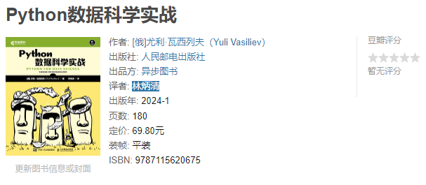

# python-for-data-science-a-hands-on-introduction
Python数据科学实战

书籍：

评价：

首先这本书比较薄，定价为70RMB，内容虽然涉及到了不少数据科学的东西，但是基本上都是点到即止的讲了一下，无论是从“学习”还是从“实战”的角度来讲，都是不够系统或者不够实践的，也对不起这个价格，如果能够打折在35~40RMB左右入手，只能够说还行，高于了这个价格入手就不是非常好了。

接着是书中的内存存在着一些问题，最典型的就是代码问题，代码使用的不是pandas 2.0或者以后的版本，这个版本之后append()函数被从pandas中移除了，但是书中的代码还是使用了append()函数来为dataframe添加新的列，如果这本书出版的较早，那么这些问题是可以理解的，但是作为一本在2024年一月左右出版的书籍，我认为存在着这样的问题是很有问题的，因为出版方没有能够核对一遍代码是否能够运行，书中在使用到numpy和pandas的时候也没有指定版本，而是单纯的给出了一个安装代码pip install numpy和pip install pandas，也没有要求使用anaconda或者miniconda之类的来管理包的版本。

最后，我没有找到原作者的ipynb代码或者github的仓库，另外第九章使用到了googlmaps和telegram bot，这些在国内（大陆地区）都没有办法使用，所以这个章节也无法实现，虽然这不是出版方和作者的问题就是了。
